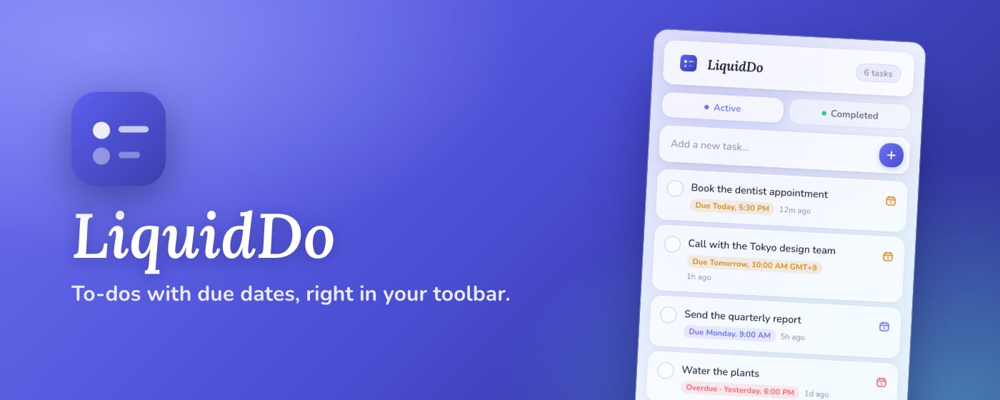
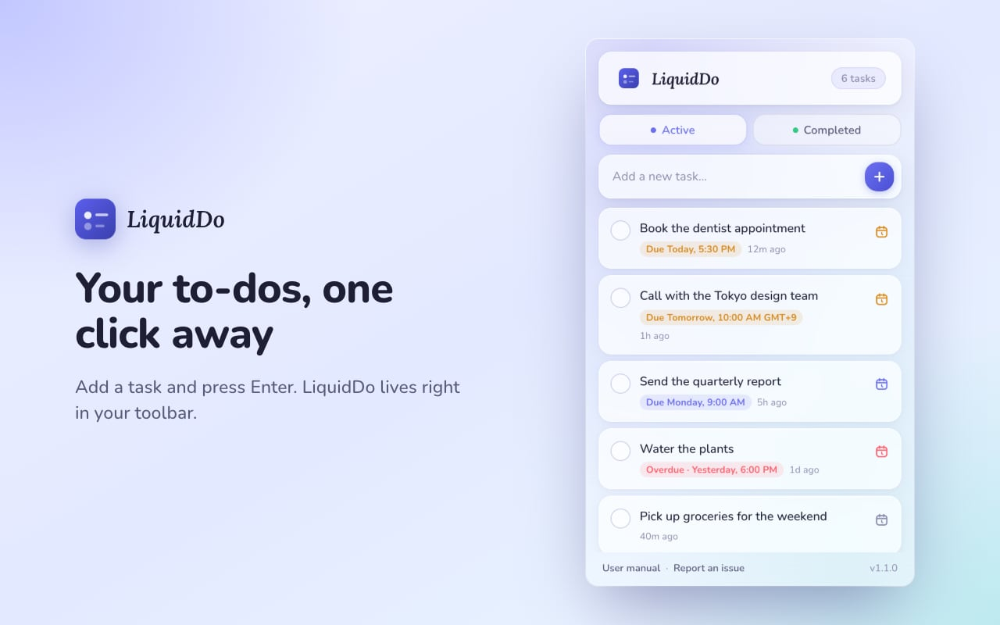
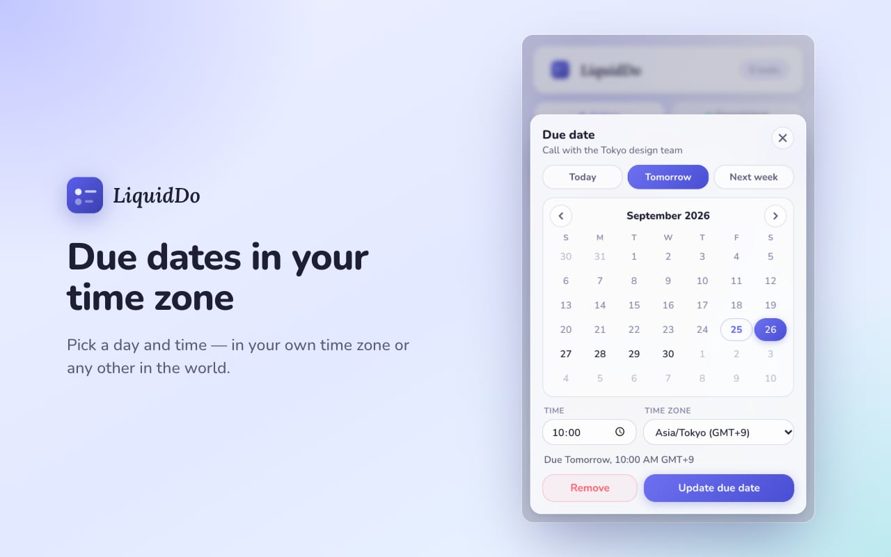

<div align="center">


# LiquidDo

**A beautiful Liquid Glass to-do list, right in your toolbar.**
A Chrome extension to add tasks, give them due dates in your time zone and tick them off — private, fully offline and nothing to sign up for.

[](https://github.com/theysap/LiquidDo/actions/workflows/ci.yml)
[](https://chromewebstore.google.com/detail/alacajgllgfcbcbggeokhdapaopjgldc)
[](https://developer.chrome.com/docs/extensions/mv3/)
[](LICENSE)

📖 **[Read the user manual](USERMANUAL.md)** — every part of the popup explained, known issues and how to report a problem.



</div>

---

## Contents

- [User manual](USERMANUAL.md)
- [Highlights](#highlights)
- [Screenshots](#screenshots)
- [Install](#install)
- [Using LiquidDo](#using-liquiddo)
- [How it works](#how-it-works)
- [Development](#development)
- [Releasing](#releasing)
- [Privacy](#privacy)
- [Contributing](#contributing)
- [License & trademarks](#license--trademarks)

## Highlights

|                                  |                                                                                                                              |
| -------------------------------- | ---------------------------------------------------------------------------------------------------------------------------- |
| ➕ **Quick add**                 | Click the icon and start typing — the task box is focused. <kbd>Enter</kbd> adds the task.                                   |
| 📅 **Due dates, your time zone** | A calendar glyph on every task: Today / Tomorrow / Next week, a month calendar, a time field and any time zone in the world. |
| 🚦 **Due at a glance**           | Labels read _Due Today, 5:30 PM_, _Due Monday…_ or red _Overdue_ — amber when due within a day.                              |
| ✅ **Active & Completed**        | Tick tasks off to move them to Completed; tick again to bring them back. Clear all completed at once.                        |
| 🪟 **Liquid Glass design**       | Frosted glass, soft gradients, rounded Nunito type with a Lora Italic wordmark, and one corner radius throughout.            |
| 🔒 **Private & offline**         | No analytics, no servers, no accounts, **no network requests** — fonts are bundled. Only the `storage` permission.           |

## Screenshots

| Your list                                                                                       | Due date & time zone                                                                                     |
| ----------------------------------------------------------------------------------------------- | -------------------------------------------------------------------------------------------------------- |
|  |  |

## Install

### From the Chrome Web Store

Install **[LiquidDo](https://chromewebstore.google.com/detail/alacajgllgfcbcbggeokhdapaopjgldc)** from the Chrome Web Store, then pin it from the puzzle-piece menu.
(GitHub Releases carry release notes only; the packaged extension is distributed through the store.)

### From source

```bash
git clone https://github.com/theysap/LiquidDo.git
cd LiquidDo
npm install
```

Open `chrome://extensions`, turn on **Developer mode**, click **Load unpacked** and select the **`src/`** folder. After editing, press ↻ on the extension card and reopen the popup.

## Using LiquidDo

| Action                 | How                                                   |
| ---------------------- | ----------------------------------------------------- |
| Add a task             | Type in the box, press <kbd>Enter</kbd> or click ＋   |
| Set a due date         | Click the calendar glyph at the right end of the task |
| Complete / un-complete | Click the circle next to a task                       |
| Delete a task          | Hover it and click ✕                                  |
| Clear completed        | **Completed** tab → **Clear all completed**           |
| Report a problem       | **Report an issue** at the bottom of the popup        |

Full details: [user manual](USERMANUAL.md).

## How it works

LiquidDo is a single Manifest V3 action popup — no background worker, no content scripts, no host permissions and no build step for the extension itself.

- **`tasks.js`** holds the pure logic (time-ago, due-date labels, time-zone maths via `Intl`) and is shared by the popup and the unit tests.
- **`popup.js`** renders the list and the due date sheet and saves on every change.
- Tasks are an array under `liquiddo_tasks` in `chrome.storage.local`:

  ```js
  {
    (id, text, done, createdAt, completedAt, dueAt, tz);
  }
  ```

  `dueAt` is an absolute timestamp; `tz` is the IANA zone it was set in (e.g. `Asia/Tokyo`), used to show the wall-clock time in that zone.

- **No network**: Lora (wordmark) and Nunito (everything else) are bundled as WOFF2 in `src/fonts/`, and the manifest's content security policy (`default-src 'self'`) blocks remote loads. `npm run validate` fails if a remote URL appears in the HTML/CSS or a network API in the JS.

## Development

**Requirements:** Node.js 22+, npm, Chrome.

```bash
npm install          # also installs the git hooks (husky)
npm run check        # lint + unit tests + manifest/version validation
npm run build        # dist/liquiddo-vX.Y.Z.zip
```

| Script                  | Purpose                                                                                          |
| ----------------------- | ------------------------------------------------------------------------------------------------ |
| `npm run lint`          | ESLint, Stylelint and Prettier (check)                                                           |
| `npm run format`        | Prettier (write)                                                                                 |
| `npm test`              | Node's built-in test runner over `tests/`                                                        |
| `npm run validate`      | Manifest shape, referenced files, version sync, changelog entry, no remote resources             |
| `npm run build`         | Deterministic zip in `dist/`                                                                     |
| `npm run screenshots`   | Store screenshots + promo tiles into `chrome/vX.Y.Z/` (`-- --docs` also refreshes README images) |
| `npm run release:local` | Full Chrome Web Store bundle into `chrome/vX.Y.Z/` (see below)                                   |
| `npm run bump -- x.y.z` | Set the version in `package.json`, `package-lock.json` and the manifest                          |
| `npm run assets`        | Re-render the icons from `assets/logo.svg` (add `-- --brand <dir>` for 4K masters)               |

### Project layout

```
src/                     ← the extension (load this folder unpacked)
  manifest.json
  popup.html · popup.css · popup.js
  tasks.js               pure task / due-date / time-zone helpers
  fonts.css · fonts/     bundled Lora Italic + Nunito (OFL)
  icons/                 generated from assets/ — don't edit by hand
scripts/                 build, zip, validate, bump, assets, screenshots, release notes, hooks
tests/                   unit tests
store/listing.md         Chrome Web Store copy template
assets/logo.svg          logo source — the popup header mark (logo-small.svg: 16–32 px variant)
docs/screenshots/        README images
.github/                 CI + release workflows, issue / PR templates
.husky/                  pre-commit & commit-msg hooks
```

### Git hooks and conventions

- **pre-commit** — refuses anything under `chrome/`, runs lint-staged (ESLint / Stylelint / Prettier on staged files), the unit tests and the validator.
- **commit-msg** — the subject must be exactly `vX.Y.Z`, matching the version in `package.json`, with any details in the commit body; `Co-authored-by` trailers are rejected.
- Every commit bumps the version (`npm run bump -- x.y.z`) and adds a matching section to [CHANGELOG.md](CHANGELOG.md) (Keep a Changelog format).

## Releasing

Public releases are cut after testing — ordinary commits are versioned but not released.

1. `npm run bump -- 1.1.0`, write the `## [1.1.0]` section in `CHANGELOG.md`, commit with the subject `v1.1.0`.
2. `npm run release:local` — builds **`chrome/v1.1.0/`** for the Chrome Web Store:

   | File                         | Use                                                                                    |
   | ---------------------------- | -------------------------------------------------------------------------------------- |
   | `liquiddo-v1.1.0.zip`        | Upload in the Developer Dashboard                                                      |
   | `store-icon-128x128.png`     | Store icon                                                                             |
   | `promo-small-440x280.png`    | Small promo tile                                                                       |
   | `promo-marquee-1400x560.png` | Marquee promo tile                                                                     |
   | `screenshot-1…5-*.png`       | Five 1280×800 screenshots, opaque PNG                                                  |
   | `brand/`                     | 4096 / 1024 / 512 px logo masters                                                      |
   | `store-listing.md`           | Name, summary, description, permission justifications, privacy answers, reviewer notes |
   | `privacy-policy.md`          | Privacy policy text                                                                    |

   `chrome/` is git-ignored and blocked by the pre-commit hook — it never reaches the repository.

3. Upload `chrome/v1.1.0/liquiddo-v1.1.0.zip` and the listing assets in the Chrome Web Store Developer Dashboard.
4. `git tag v1.1.0 && git push origin master --tags` — the **Release** workflow re-runs every check, confirms the tag matches the manifest and publishes a GitHub Release with notes from the changelog. **No zip is attached** — the zip is only for the Chrome Web Store.

### CI

[`ci.yml`](.github/workflows/ci.yml) runs on every push and pull request: lint, unit tests, validation, the commit-message convention for the pushed range, and a build check (the zip is not uploaded anywhere).

## Privacy

LiquidDo collects nothing and makes no network requests: no analytics, no telemetry, no accounts. Tasks live only in `chrome.storage.local` on your computer. Full policy: [PRIVACY.md](PRIVACY.md).

## Contributing

Found a bug? See [How to report an issue](USERMANUAL.md#how-to-report-an-issue). Issues and pull requests are welcome — please use the templates. Before opening a PR run `npm run check`, bump the version and add a changelog entry.

## License & trademarks

[MIT](LICENSE) © 2026 Aashish Paruvada. Bundled fonts: [Lora](src/fonts/OFL-Lora.txt) and [Nunito](src/fonts/OFL-Nunito.txt), SIL Open Font License 1.1.

LiquidDo is an independent project and is not affiliated with, endorsed by or sponsored by Apple or Google. "Liquid Glass" is referenced only to describe the design inspiration.
